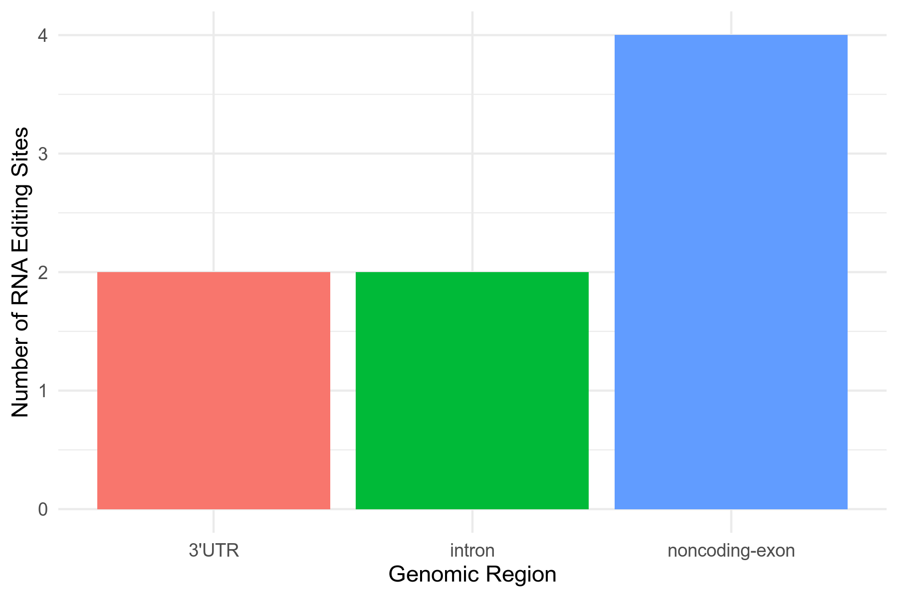

# RNA Editing
> An answer `md` file for Bioinformatics_Homework_RNA_regulation_RNA_editing

> Direct to [T1](#t1), [T2](#t2) quickly here.
---
### T1
> `gvf` and `vcf` files explained

> Check source [`gvf`](./Data/chr1.editingSites.gvf) and [`vcf`](./Data/chr1.editingSites.vcf) files
##### 1.1 **`gvf` file**
* Format
  * Genome Variation Format
  * Colnames explained

    | Col | Column name | Meaning | Example |
    | :---: | :--- | :--- | :--- |
    | 1 | #Gene_ID | Ensembl ID for genes | ENSG00000225159 |
    | 2 | Name | Name of the gene | NPM1P39 |
    | 3 | SEGMENT | Type of genomic region | noncoding-exon |
    | 4 | #CHROM | Chromosome number | 1 |
    | 5 | GENE_START | Start position of the gene on the chromosome | 27206930 |
    | 6 | GENE_STOP | End position of the gene on the chromosome | 27207796 |
    | 7 | VAR_ID | Variant ID (usually empty if not in dbSNP) | . |
    | 8 | VAR_POS | Exact position of the editing site on the chromosome | 27206932 |
    | 9 | REF | Reference base at the position | A |
    | 10 | ALT | Alternative base detected in RNA-seq (edited base) | G |
    | 11 | QUAL | Phred quality score (higher is better, >20 is reliable) | 66.28 |
    | 12 | #A | Number of reads supporting A | 0 |
    | 13 | #C | Number of reads supporting C | 1 |
    | 14 | #G | Number of reads supporting G | 6 |
    | 15 | #T | Number of reads supporting T | 0 |
    | 16 | Reads_Total | Total number of reads covering this position | 7 |
    | 17 | Edited_Reads | Number of reads supporting the edited base (ALT) | 6 |
    | 18 | Editing_Ratio | Editing ratio = Edited_Reads / Reads_Total | 0.86 |
* The output [`gvf` file](./Data/chr1.editingSites.gvf) has 8 rows excluding column name, corresponding to 8 genes undergoing RNA editing
##### 1.2 **`vcf` file**
* Format
  * Variant Call Format
  * Colnames explained

    | Col | Column name | Meaning | Example |
    | :---: | :--- | :--- | :--- |
    | 1 | #CHROM | Chromosome number where the variant is located | 1 |
    | 2 | POS | Position of the variant on the chromosome | 27206932 |
    | 3 | ID | Variant identifier (usually dbSNP ID; "." means not in dbSNP) | . |
    | 4 | REF | Reference base at the position | A |
    | 5 | ALT | Alternative base detected in RNA-seq (edited base) | G |
    | 6 | QUAL | Phred quality score (higher is better, >20 is reliable) | 66.28 |
    | 7 | FILTER | Filter status ("." means all filters passed) | . |
    | 8 | INFO | Additional information in TAG=VALUE format (see below) | ExcessHet=3;ABHom=1;... |
  * INFO explained

    | TAG | Meaning | Example | Explanation |
    | :---: | :--- | :--- | :--- |
    | ExcessHet | Excess heterozygosity | 3 | Measures deviation from Hardy-Weinberg equilibrium |
    | ABHom | Allele balance for homozygotes | 1 | Ratio of reads supporting the variant in homozygotes |
    | ABHet | Allele balance for heterozygotes | 0 | Ratio of reads supporting the variant in heterozygotes |
    | AC | Allele count in genotypes | 2 | Number of alternate alleles in called genotypes |
    | AN | Total allele count | 2 | Total number of alleles in called genotypes |
    | AF | Allele frequency | 1 | Frequency of the alternate allele (1 = 100%) |
    | MLEAC | Maximum likelihood expectation allele count | 2 | MLE estimate of alternate allele count |
    | MLEAF | Maximum likelihood expectation allele frequency | 1 | MLE estimate of alternate allele frequency |
    | FS | Fisher strand bias p-value | 0 | P-value for strand bias (lower is better) |
    | SOR | Strand odds ratio | 3 | Strand bias test using odds ratio |
    | MQ | RMS mapping quality | 37 | Root mean square mapping quality of reads |
    | MQ0 | Number of reads with mapping quality zero | 0 | Count of reads with MAPQ = 0 |
    | QD | Quality by depth | 11 | QUAL divided by depth (higher is better) |
    | DP | Total depth | 7 | Total number of reads covering this position |
    | Dels | Number of deletion alleles | 0 | Count of reads with deletions |
    | HaplotypeScore | Consistency of haplotypes | 0 | Score for haplotype consistency |
    | BaseQRankSum | Base quality rank sum test | -1 | Z-score from Wilcoxon rank sum test for base quality |
    | ReadPosRankSum | Read position rank sum test | -1 | Z-score for read position bias |
    | MQRankSum | Mapping quality rank sum test | 0 | Z-score for mapping quality bias |
    | GI | Gene information | ENSG00000225159:noncoding-exon | Gene ID and transcript region where variant is located |
    | BaseCounts | Base counts at this position | 0,1,6,0 | Counts of A, C, G, T reads (in that order) |
* The output [`vcf` file](./Data/chr1.editingSites.vcf) has 6 rows excluding column name, corresponding to 6 RNA editing sites discovered
* Comparing it with the [`gvf` file](./Data/chr1.editingSites.gvf) suggests that position `87046554` on chr1 affected `3` different genes
---
### T2
> Visualization of RNA editing sites on genomic regions
* Run the following command to acquire [`txt` result](./Results/chr1.editingSites.dist.txt)

    ```bash
    $ tail -n +2 chr1.editingSites.gvf |\
    > cut -f3 | sort | uniq -c |\
    > awk '{print $2"\t"$1}' >\
    > chr1.editingSites.dist.txt
    ```

    | Region | RNA Editing Sites |
    | :--- | :---: |
    | 3'UTR | 2 |
    | intron | 2 |
    | noncoding-exon | 4 |
* Create [`R` script](./Results/scr.R) for visualization

    ```R
    library(ggplot2)

    result <- read.table("chr1.editingSites.dist.txt", header = FALSE, col.names = c("Region", "Edits"))

    png("chr1.editingSites.dist.png", width = 6, height = 4, units = "in", res = 300)
    ggplot(result, aes(x = Region, y = Edits, fill = Region)) +
    geom_bar(stat = "identity") +
    labs(x = "Genomic Region", y = "Number of RNA Editing Sites") +
    theme_minimal() + 
    theme(legend.position="none")
    dev.off()
    ```
* Check `png` [here](./Results/chr1.editingSites.dist.png)

---